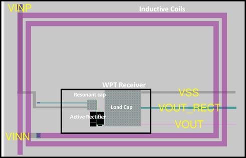
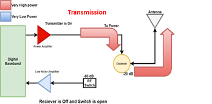
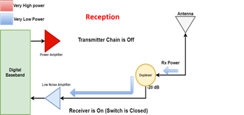
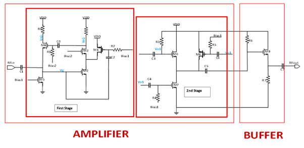
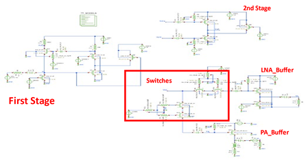
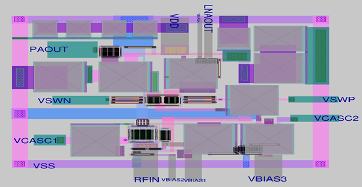
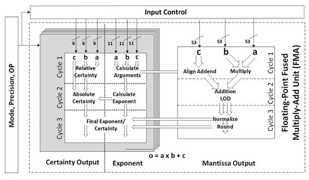
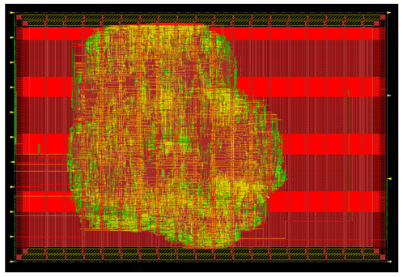

# Inductor Less Bi-Directional Amplifier for 5G

  

---

### Pakistan 1,2,3 Tapeout Projects
### 1)	Backscattering Integration for On-Chip Wireless Power Transfer (WPT) Receivers
### Introduction
Proposed project  implement WPT system having the capability of a passive backscattering using the single power transfer coils. The design goal of project will be to implement an on-chip resonant WPT system that capable of harvesting energy from external off chip coils, harvest the megnteic energy using an active recitifier and derive a load.

  
Wireless Power Transmission (WPT) is realized using resonant coils. Primary and Secondary coils are loaded with capacitors which are tuned at same frequency. Despite of low coupling coefficients MCR-WPT provides high power transfer at a single resonant frequency . Active rectification was used technique for improving the efficiency of rectification by replacing diodes with actively controlled switches with or power bipolar junction transistors.  Normal semiconductor diodes have a roughly fixed voltage drop of around 0.5-1 volts, active rectifiers behave as resistances, and can have arbitrarily low voltage drop. The voltage drop across the transistor is then much lower, which reduces the power loss. Finally an off chip ‘backscattered signal’ is used to change the impedence of coils.

### Circuit Schematic
  

### Layout
  

### 2)	Bi-Directional Amplifier Architecture for Sub-6 GHz 5G
### Introduction
TDD (Time division duplexing) RF front ends operate in such a manner that during Transmission, receiver side is isolated using and switch and power amplifier is driving the transmission antenna, During Reception, transmitter chain is isolated and the received signal from the antenna is fed to a low noise amplifier.

     

Figure below shows the 2-stage amplifier that is used to provide voltage gain in the circuit. In the first stage Transistors M0 and M1 provide transconductance. Transistor M1 also reduces current through M2 and increases the value of Resistor and drain of M2. Due to this cascode and current re-use technique we obtain a large voltage gain. Transistor M4 is used to provide voltage to current feedback from output to input such that the input impedance is governed transistor M4. Transistor M5 establishes bias voltage for the gate of M0. The second stage combines the differential output from stage 1 in such a way that the noise contribution of transistor M4 is cancelled

  
### Circuit Schematic
  
### Circuit Layout
  

### 3)	Variable Precision Fused Multiply Add Unit

### Introduction
Higher precisions of floating point offer higher accuracy but are more expensive in terms of power and throughput. An efficient FMA may have higher throughput, but compromise much on precision of a floating-point number, while utilizing less power. Therefore, when an inputs are higher precision numbers and throughput is the main concern other than the accuracy. Arithmetic operations could be performed in lower precision datapaths, it would yield approximate results (Approximate Computing). This allows circuits to operate at higher throughput at lower power utilizing lower precision datapath. As an example, a double precision fused add unit can perform a single double precision operation, two single precision or four half precision operations in the same iteration, while performing exact calculations. While, we can perform two or four double precision approximate arithmetic operation while utilizing two single precision, or four half precision datapaths respective.

  
 ### Layout
 
